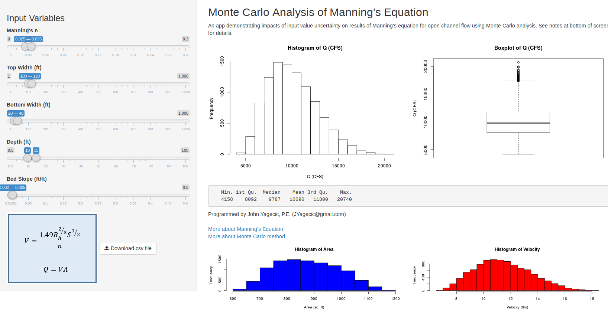
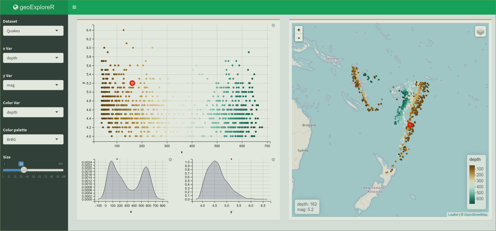
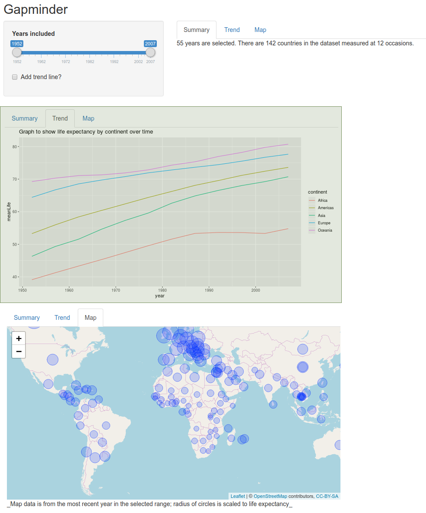

## What is Chris Beeley?

```{r, echo = FALSE}

library(DiagrammeR)

```

- Chris Beeley is from Nottinghamshire Healthcare
- Using R for 11 years
- Shiny for 7 (when all this were fields)

## What is Shiny?

* Shiny is a web application programming framework
* It's a big sack of HTML, JavaScript, and CSS, all called from R, basically
* It requires no knowledge of HTML, JavaScript, or CSS, but if you have that knowledge it will do more

## What does Shiny do?

* It does this

```{r, echo = FALSE}

shinyAppDir("~/R/x86_64-pc-linux-gnu-library/3.6/shiny/examples/01_hello/")

```

## But it also does this

```{r, out.width = "1000px", echo = FALSE}



```

## And this

```{r, out.width = "900px", echo = FALSE}



```

## How does Shiny work?

* Reactive programming
* When the inputs change, the outputs change
* Outputs *take a dependency on* inputs
* The Bad Old Days
* What you lose
* E.g. CRUD is hard
* You can control reactive dependencies (more later)

## Let's make an app!

* File... 
* New... 
* Shiny web app... 
* Application name... 
* Multiple file... 
* Choose directory

## The fundamentals

* The fundamentals of Shiny apps are very simple
* You define a bunch of inputs using functions like textInput() and numericInput() in ui.R
* Each input has a name
* You lay out your outputs in ui.R using functions like textOutput() and plotOutput()
* Each output has a name
* Using the names you just defined in ui.R, you define a bunch of outputs in server.R using functions like renderPlot() and renderText()
* Within server.R you can access the value of inputs using input$nameOfInput
* It makes a lot of sense if you just browse the code, which we will do now

## We'll add a title to get warmed up

* Inputs are defined like this 

```{r, eval=FALSE}

textInput("nameOfInput", "Label for input")

```
* See ?textInput for more
* Add textInput(...) to the UI definition. In sidebarPanel()
* Inputs are referred to like this 

```{r, eval=FALSE}

input$nameOfInput

```

* And then add main = input$nameOfInput to the hist(...)

## The answer

ui.R

```{r, eval = FALSE}

sidebarPanel(
  sliderInput("bins",
              "Number of bins:",
              min = 1,
              max = 50,
              value = 30),
  textInput("titleInput", "Add a title")
),

```

server.R

```{r, eval = FALSE}

hist(x, breaks = bins, col = 'darkgray', 
     border = 'white', main = input$titleInput)

```

## Now let's make an application from scratch!

```{r,echo = FALSE}



```

## Tabset panels

* Tabset panels are useful if you want multiple outputs but not all on the same page

```{r, eval = FALSE}

mainPanel(
  tabsetPanel(
    tabPanel("Label", outputFunction("nameOfOutput")),
    tabPanel("Label2", outputFunction2("nameOfOutput2"))
  )
)

```

## Some code for you to use

```{r, eval = FALSE}

# server side

renderText({...})

renderPlot({...})

renderLeaflet({...})

# ui.R

sliderInput({...})

checkboxInput({...})

textOutput(...)

plotOutput(...)

leafletOutput(...)

tabsetPanel(
  tabPanel("Label", outputFunction("nameOfOutput")),
  tabPanel("Label2", outputFunction2("nameOfOutput2"))
)

```

## Add smooth to plot

```{r, eval = FALSE}

if(input$linear){ 
  thePlot = thePlot + geom_smooth(method = "lm") 
} 

return(thePlot)

```

## Reactive expressions

- Reactive expressions are expressions that change when their inputs change
- They enable you to maintain the data fetch/ clean code for several outputs in one place
- Crucially, they *cache* their results, which means that it's run once, for all the outputs, and only changes if its inputs change
- Great for computationally intensive or bandwidth heavy data functions

## Standard Shiny

```{r, echo = FALSE, warning = FALSE}

node_df <- create_node_df(n = 5 ,
                          label = c("Input 1", "Input 2", "Output 1", 
                                    "Output 2", "Output 3"),
                          fontsize = 24,
                          fillcolor = c("green", "green", "red", "red", "red"),
                          fontcolor = "black")

edge_df <- data.frame("from" = c(1, 1, 2, 2),
                      "to" = c(3, 4, 4, 5))

i_graph_1 <-
  create_graph()

i_graph_2 <-
  i_graph_1 %>%
  add_nodes_from_table(
    table = node_df,
    label_col = label)

i_graph_3 <-
  i_graph_2 %>%
  add_edges_from_table(
    table = edge_df,
    from_col = from,
    to_col = to,
    from_to_map = id_external)

i_graph_3 %>% render_graph()

```

## With reactive object

```{r, echo = FALSE, warning = FALSE}

node_dfR <- create_node_df(n = 6,
                           label = c("Input 1", "Input 2", "Reactive object", "Output 1", 
                                     "Output 2", "Output 3"),
                           fontsize = 24,
                           fillcolor = c("green", "green", "blue", "red", "red", "red"),
                           fontcolor = "black")

edge_dfR <- data.frame("from" = c(1, 2, 3, 3, 3),
                       "to" = c(3, 3, 4, 5, 6))

i_graph_1 <-
  create_graph()

i_graph_2 <-
  i_graph_1 %>%
  add_nodes_from_table(
    table = node_dfR,
    label_col = label)

i_graph_3 <-
  i_graph_2 %>%
  add_edges_from_table(
    table = edge_dfR,
    from_col = from,
    to_col = to,
    from_to_map = id_external)

i_graph_3 %>% render_graph()

```

## The code

```{r, eval = FALSE}

theData = reactive({
  
  mapData %>%
    filter(year >= input$year[1], year <= input$year[2])
})

```

```{r, eval = FALSE}

output$trend = renderPlot({ 
  
  thePlot = theData()
    ... etc.
})

```

## Debugging

- Start simple
- Make sure your code works outside of Shiny!
- Use of cat()
- Breakpoints and browser()
- Run options(shiny.reactlog=TRUE)
    * Run
    * Press Ctrl+F3 for an interactive summary of reactive activity in your application
    * This has saved me more than once

## Super whizzy tricks

- Reactive UI
- Populate controls
- Control the whole UI, e.g. passwords or loading screens
- Controlling reactivity with observe and isolate
- Validate() and req()
- JavaScript
- Crosstalk
- Interacting with tables
- Saving and loading data
- Global.R
- Shiny on webpages
- Bookmarks
- Persistence and databases
- [The shinyverse](https://chrisbeeley.net/?p=1157)


